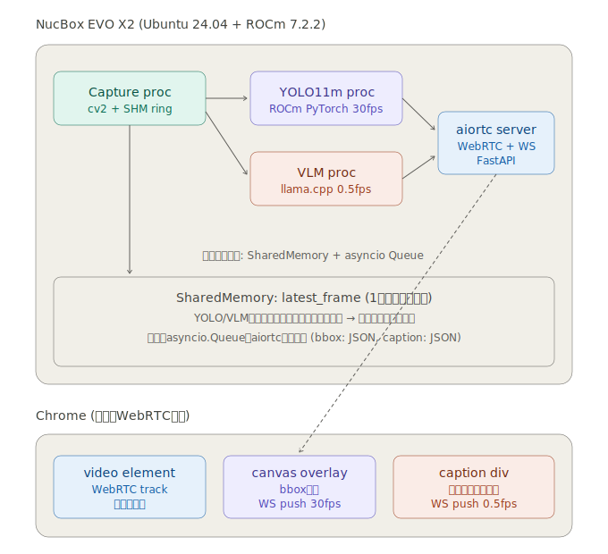
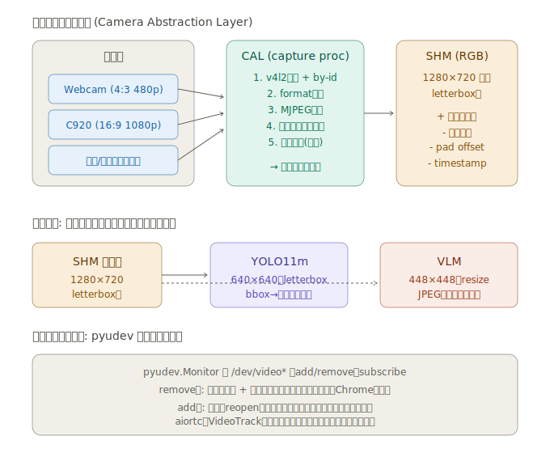

# 技術詳細

このドキュメントは [`HANDOFF.md`](./HANDOFF.md) で示した設計をどう実装したか、なぜその設計を選んだか、そして実装中に判明した落とし穴を体系化したものです。導入手順は [`READMEJ.md`](./READMEJ.md) を参照。

> **転送経路について**: 当初は WebRTC (aiortc) で映像配信する設計でしたが、オフライン環境 (Wi-Fi OFF / インターネット非接続) で Chrome が ICE host candidate を 1 件も emit しないために接続不能になる事象を踏み、MJPEG (`multipart/x-mixed-replace`) over HTTP に移行しました。詳細は §5 と §7.4 を参照。

---

## 1. アーキテクチャ全体像



NucBox EVO X2 (Ryzen AI MAX+ 395, gfx1150, 48 GB unified) 1 台のうえで 4 つの並走コンポーネントを動かし、Chrome へ MJPEG (`/stream.mjpg`) + WebSocket で配信します。

| コンポーネント | プロセス | 入力 | 出力 |
|---|---|---|---|
| Capture | `uv run capture-run` | USB カメラ | SHM (1280×720 BGR letterbox 済) |
| YOLO11m | `serve` 内のバックグラウンドスレッド | SHM | bbox JSON → `/ws/bbox` |
| VLM | `llama-server --reasoning off` (別プロセス) | `serve` の VlmRunner からの HTTP リクエスト (画像+プロンプト) | キャプション JSON → `/ws/caption` |
| MJPEG サーバ | `uv run serve` (FastAPI + uvicorn) | SHM | `/stream.mjpg` (multipart/x-mixed-replace) + WS broadcast |

**設計の鍵となる判断**

- **SHM は "latest frame slot" 1 つだけ**。Capture は常時上書き、読み手 (MJPEG / yolo / vlm) は推論開始時にスナップショット (`np.array(copy=True)`) する。古いフレームでの推論積み残しを構造的に防ぐ。
- **キューにはフレームを乗せない**。bbox / caption JSON だけが asyncio.Queue → WebSocket に流れる。
- **VLM へのフレーム受け渡しは JPEG 圧縮済みバイト列**。SHM の生 BGR を `cv2.imencode('.jpg', ...)` してから llama-server の `/v1/chat/completions` に base64 で投げる。
- **YOLO は `serve` プロセス内のスレッドで動く**。HANDOFF の元案は別プロセスだが、torch/CUDA は GIL を C++ 中で解放するので asyncio loop を block しない。Step 5 で fp16 推論 8 ms p50 が確認できた時点でこの判断は妥当。
- **VLM だけは別プロセス (llama-server)**。理由は (a) 21 GB の GGUF を Python venv とは独立に常駐させたいこと、(b) llama.cpp のチューニングや再起動を server 本体と切り離したいこと。

---

## 2. カメラ抽象化レイヤ (CAL)



「画角の違うカメラ・差し込むポートが変わっても動く」要件を満たすため、`src/capture/` に物理層 → 正規化フレーム生成までを集約しました。

### 2.1 デバイス検出 (`device_manager.py`)

- `pyudev.Context().list_devices(subsystem='video4linux')` で udev に登録された v4l デバイスを列挙
- USB の `ID_VENDOR_ID` / `ID_MODEL_ID` を取り出して `vid_pid="046d:0892"` のような指定にも対応
- `/dev/v4l/by-id/...` の symlink からは安定 ID として `by_id` を取得
- 1 つの USB カメラが `index0` (映像) / `index1` (メタデータ) など複数 v4l ノードを作るので、`is_capture_capable()` で実際に `cv2.VideoCapture.read()` 成功するノードに絞り込み
- `config.yaml` の `camera.preferred[]` をパターン照合 (glob `usb-Logitech*` / VID:PID) → なければ `fallback: any`

### 2.2 フォーマット交渉 (`format_negotiator.py`)

`cv2.VideoCapture` の `set(CAP_PROP_FOURCC, ...)` ladder を `MJPG → YUYV` の優先順で試行し、`get(CAP_PROP_*)` で実際に確定した値を読み戻します。MJPEG を優先するのは USB 帯域効率が YUYV より圧倒的に良いから (1280×720@30fps が YUYV だと USB 2.0 帯域で破綻しやすい)。

### 2.3 letterbox 二段構成 (`frame_normalizer.py`)

- **CAL 出力 = 1280×720 固定 BGR letterbox 済**
- スケール = `min(target_w/src_w, target_h/src_h)` でアスペクト保ったまま縮小、余白は `(114, 114, 114)` グレーで埋める
- `pad_x / pad_y / scale / original_w / original_h` を SHM ヘッダに記録 → 下流で逆変換可能
- **YOLO11m 入力 (640×640) と VLM 入力 (~448) は Ultralytics / mtmd 側で自動 letterbox**。CAL では二段目を作らない (重複変換のコストを避ける)
- bbox 座標は CAL 正規化フレーム (1280×720) 上の絶対座標で WS 送出。Chrome 側は `<canvas width=1280 height=720>` の固有解像度を CSS でビデオに合わせるだけ → 1 段の縮尺だけで描画可能

### 2.4 ホットプラグ対応 (`hotplug_watcher.py`, `capture_session.py`)

- `pyudev.MonitorObserver(filter_by='video4linux')` で `add` / `remove` イベントを Queue に積む
- メイン loop は **2 状態の状態機械**:
  - `SEARCHING`: capture 不能。30 fps で黒フレーム + `connected=False` を SHM に書き続ける (下流が「カメラ不在」を即座に認識できる)
  - `CAPTURING`: `cv2.VideoCapture` を別スレッド (`CaptureReader`) で読み、main thread が SHM へ書く
- `CaptureReader` は `cv2.VideoCapture.read()` の抜き取り時ブロックを避けるため、daemon thread で常時 read。停止時は `cap.release()` で stuck read を解除
- `add` イベントで即時 rescan、`remove` 時に当該 dev_path がアクティブなら SEARCHING に遷移
- MJPEG ストリームは SHM 経由で間接接続なので、カメラが入れ替わっても Chrome の `` を切らない (HTTP 接続は維持、黒フレームを挟んで実映像復帰)

---

## 3. SharedMemory 設計 (`shm_writer.py`)

### 3.1 レイアウト (合計 36 B + frame data)

| offset | size | フィールド |
|--------|------|----------|
| 0 | 8 | `seq_lock` (uint64): even=stable / odd=writer mid-write |
| 8 | 8 | `timestamp_ns` (uint64) |
| 16 | 2 | `original_w` (uint16) |
| 18 | 2 | `original_h` (uint16) |
| 20 | 2 | `frame_w` (uint16) |
| 22 | 2 | `frame_h` (uint16) |
| 24 | 2 | `pad_x` (uint16) |
| 26 | 2 | `pad_y` (uint16) |
| 28 | 4 | `scale` (float32) |
| 32 | 1 | `channels` (uint8) |
| 33 | 1 | `pixel_format` (uint8): 0=BGR / 1=RGB |
| 34 | 1 | `connected` (uint8): 0=合成黒フレーム / 1=実映像 |
| 35 | 1 | (padding) |
| 36 | W·H·3 | frame data (uint8) |

`struct` フォーマット: `<QQHHHHHHfBBB1x` (Python の struct.calcsize で 36 確認済)。

### 3.2 seqlock の挙動

ライター (Capture) は単一プロセス。x86_64 の整列 8 byte 書き込みは hardware atomic なのでロックフリー seqlock が成立します。

```
ライター:
    1. seq = next odd      (= 書き込み中マーカー)
    2. ヘッダとフレームを書き込む
    3. seq = next even     (= 完了マーカー)

リーダー:
    for retry in range(16):
        s1 = read seq
        if s1 odd: sleep(100us); continue   ← ライターと衝突中
        copy header + frame
        s2 = read seq
        if s1 == s2: success
        else: continue                       ← copy 中にライターが上書き
    return None                              ← 16 retry でも捕まえられず
```

### 3.3 「画面が一瞬黒くなる」バグの修正

初版ではリーダーがタイトに 8 retry → 失敗で `None` 返却 → 下流 (当時の `ShmVideoTrack`、現在の MJPEG generator) が黒フレームに fallback、というパスで Chrome 上に時々 1 frame の黒が出ていました。原因は:

- ライターの "odd" 滞在時間 ≈ 500 µs (`np.copyto` で 2.6 MB)
- リーダーの 8 retry はタイトループで合計 ~8 µs しか経過せず、ライターが終わる前に諦めていた

修正:

1. `read()` の retry に `time.sleep(100us)` を挟み、最大 retry を 8 → 16 に
2. 下流側で「最後に成功したフレーム」をキャッシュし、None だったら直前フレームで埋める (TTL 1 秒で stale ガード) — WebRTC 時代の `ShmVideoTrack` で導入、現行の MJPEG generator にも同様のフォールバックを実装

これで Chrome 上の黒フレーム発生は実測 0 に。

### 3.4 resource_tracker パッチ

`multiprocessing.shared_memory` には [bpo-38119](https://bugs.python.org/issue38119) があり、attach した側でも `unlink` しようとして spurious warning や二重 unlink が起きます。`_suppress_resource_tracker_for_shm()` で `register` / `unregister` をモンキーパッチして無視させる定石対応を入れています。

---

## 4. 推論バックエンド

### 4.1 YOLO11m (Step 3)

| 項目 | 値 |
|------|----|
| バックエンド | Ultralytics + ROCm PyTorch 2.9.1 |
| 入力 | 1280×720 BGR (SHM 正規化フレーム) |
| `imgsz` | 640 (Ultralytics 内部で letterbox + 逆変換、bbox は元座標で返る) |
| 量子化 | fp16 (`yolo.half: true`) |
| 単独 fps | **97.8 fps** (`benchmark-yolo --source shm`、ただし dedup なし、GPU 律速) |
| パイプライン fps | **30.1 fps** (`benchmark-concurrent --no-vlm`、カメラ 30fps 律速) |

**ベースラインの取り違いに注意**: `benchmark-yolo --source shm` は SHM 重複 read で同フレーム何度も推論する → GPU 純粋スループット 97.8。一方 `benchmark-concurrent --no-vlm` は `meta.seq` で dedup → カメラレートに張り付く 30 fps。Step 5 の比較は後者を baseline に取らないと「-71% 劣化」のような誤読が起きます。

退避プラン (`scripts/export_yolo_onnx.py`): `model.export(format='onnx', imgsz=640, simplify=True)` で ONNX を吐き、`onnxruntime` で読める状態を維持。CPU EP で実測 **15.4 fps** (30 fps target には届かないので primary ではなく、graceful degradation 用)。MIGraphX EP は AMD-built ort 必須。

### 4.2 Nemotron-3 Nano Omni (Step 4 / 7b)

| 項目 | 値 |
|------|----|
| モデル | `unsloth/NVIDIA-Nemotron-3-Nano-Omni-30B-A3B-Reasoning-GGUF`, Q4_K_XL (~21 GB) + mmproj-F16 (~1.5 GB) |
| ランタイム | llama.cpp ROCm/HIP build (`llama-server` 常駐) |
| 入力 | 1280×720 BGR → JPEG (quality 90) → base64 → `/v1/chat/completions` |
| `n_predict` | 128 (50 字程度の日本語キャプション、~60-100 tokens) |
| 単独 inference | **~1262 ms** (Step 4 mtmd-cli) / `~1300 ms` (Step 7b llama-server) |
| 並走 inference | **~1294 ms** (Step 5、YOLO 同居時)、+2.5% の劣化のみ |

**`--reasoning off` 必須**。Reasoning モデルなのでデフォルト (`auto`) では `<think>` タグに `n_predict` を全消費し、回答が空になります。同じ GGUF を `mtmd-cli` で使うと空 `<think></think>` の挙動になるので両ランタイムで違うのは要注意。

`VlmServerWorker` は llama-server の `/v1/chat/completions` レスポンスから:

- `choices[0].message.content` をキャプション本文として取得
- `<think>...</think>` を正規表現で除去 (保険)
- `timings.prompt_ms / predicted_ms / *_per_second` と `usage.prompt_tokens / completion_tokens` を `VlmTiming` に詰める

### 4.3 Step 5: YOLO + VLM 同居の Go/No-Go

```
                          YOLO alone   YOLO+VLM (fp32)   YOLO+VLM (fp16)
fps                       30.1         27.9              27.9
p50 latency (ms)          11.07        11.78             8.05
p99 latency (ms)          11.80        88.67             112.32
VLM median inf (ms)       —            1294              1151
VLM eval_tps              —            48.1              53.6
```

`benchmark-concurrent --frames 600` の出力。fp16 が VLM 側の余裕を増やす ("YOLO が早く終わるので VLM が触れる窓が広がる") のがこのデータから読み取れる重要な発見です。p99 spike (~100 ms) は VLM の eval phase でのコンテキストスイッチ起因で、bbox 描画上は約 3 frame の stutter として現れる程度。

---

## 5. 映像配信 (`src/server/`)

### 5.1 経緯: なぜ WebRTC を捨てたか

当初は aiortc + `RTCPeerConnection` で WebRTC video track を配信する設計で、同一 LAN ならホスト candidate だけで繋がる想定でした。実装後、自宅オフライン環境 (Wi-Fi OFF / インターネット非接続) で次の症状に遭遇:

- `POST /offer` は 200 を返す
- aiortc は `connection state -> connecting` に遷移する
- が、その先 `connected` にも `failed` にも進まず無限に滞留 → ブラウザの映像が黒のまま

`chrome://webrtc-internals` で確認したところ、Chrome 側で `onicecandidate` が**一度も発火しておらず**、`iceState=new` のまま。Wi-Fi OFF で非ループバック interface が無くなった結果、Chrome の WebRTC スタックが local host candidate を 1 件も emit しなくなったのが直接原因です。試した対策と結果:

1. **aioice の loopback フィルタ除外をモンキーパッチ** (サーバ側で `127.0.0.1` を host candidate に乗せる) → サーバ側 candidate は出るが、Chrome 側がそもそも候補を出さないので無効
2. **`http://localhost:8080/` ↔ `http://127.0.0.1:8080/` 切替** → 変化なし
3. **`chrome://flags/#enable-webrtc-hide-local-ips-with-mdns` を Disabled** → 変化なし
4. **`RTCPeerConnection({iceServers: [{urls: 'stun:127.0.0.1:3478'}]})`** (届かない dummy STUN を入れて Chrome の gathering を起こす) → 変化なし
5. **trickle ICE 実装** (`POST /candidate` で逐次受け取り、クライアントは `icecandidate` イベントで送信) → Chrome がイベント自体を発火しないので無意味

Chrome 側の挙動を変えられないため、ICE を必要としない経路にスイッチ。

### 5.2 MJPEG ストリーム (`app.py`)

`GET /stream.mjpg` で `multipart/x-mixed-replace; boundary=frame` を返す `StreamingResponse`:

```python
@app.get("/stream.mjpg")
async def stream_mjpg() -> StreamingResponse:
    async def gen():
        shm: FrameSHM | None = None
        last_seq = -1
        black = np.zeros((target_h, target_w, 3), dtype=np.uint8)
        while True:
            t_start = time.monotonic()
            if shm is None:                              # lazy attach
                try: shm = FrameSHM.attach(shm_name)
                except (FileNotFoundError, RuntimeError): pass
            frame = black
            if shm is not None and (got := shm.read()) is not None:
                fresh, meta = got
                if meta.seq != last_seq:
                    frame = fresh; last_seq = meta.seq
                else:
                    frame = fresh
            ok, jpeg = await asyncio.to_thread(
                cv2.imencode, ".jpg", frame, [cv2.IMWRITE_JPEG_QUALITY, jpeg_quality])
            if ok:
                yield (f"--frame\r\nContent-Type: image/jpeg\r\n"
                       f"Content-Length: {len(jpeg)}\r\n\r\n").encode() + jpeg.tobytes() + b"\r\n"
            await asyncio.sleep(max(0.0, frame_period - (time.monotonic() - t_start)))
    return StreamingResponse(gen(), media_type="multipart/x-mixed-replace; boundary=frame", ...)
```

要点:

- **lazy attach**: capture-run が後から起動しても自動接続。未 attach の間は `black` を流して接続を保つ
- **JPEG エンコードは off-thread**: `cv2.imencode` は CPU を持って行くので `asyncio.to_thread` で event loop から逃がす (Python 3.9+)
- **rate limit**: `config.yaml > camera.format.fps` (= 30) を frame_period に換算し、`asyncio.sleep` で 30fps 上限
- **品質**: `config.yaml > server.mjpeg_quality` (default 80)。1280×720 で 1 フレーム ~80-120 KB、30fps で 20-30 Mbps 程度
- **STUN / TURN / ICE 一切無し**: plain HTTP only。LAN 越しも `<NucBox>:8080` で素直に動作

### 5.3 WS broadcast (`ws_broadcaster.py`, `yolo_runner.py`, `vlm_runner.py`)

WebRTC 移行で `/ws/bbox` と `/ws/caption` のロジックは無傷:

- `WsBroadcaster`: クライアント集合 + asyncio Lock + JSON broadcast。送信失敗のクライアントを自動 drop
- `YoloRunner`: daemon thread。SHM read → predict → `_latest = {...}` を thread-safe slot で更新
- `_broadcast_bbox_loop`: 30 fps の async task、`frame_seq` で dedup して `/ws/bbox` に push
- `VlmRunner`: 同型、cadence 2 秒。llama-server health check → SHM attach → loop。`ts_ns` で dedup
- `_broadcast_caption_loop`: 0.5 fps cadence

### 5.4 フロントエンド (`src/web/`)

- `` (MJPEG)、`<canvas>` (bbox)、半透明 `<div>` (caption) の 3 層
- `<canvas>` は `width=1280 height=720` 固定、CSS で `` に被せる。bbox 座標が CAL 正規化フレーム空間そのままなので 1 段スケールで描画
- `` の `load` で status を `streaming` 表示、`error` で指数バックオフ (上限 5s) して `?t=<ts>` キャッシュバスター付きで `src` を差し替え再接続
- `overlay.js` / `caption.js` ともに WebSocket disconnect 時は exponential backoff で再接続 (上限 5 秒)

### 5.5 残置ファイル

`src/server/webrtc_track.py` は未使用ですが「将来 STUN/TURN が用意できる環境で再投入する」可能性を残して保持しています。`pyproject.toml` の `[webrtc]` extra も同様の理由で `aiortc` を残してありますが、現行 `serve` は import しません。

---

## 6. 起動・終了スクリプト

### `start_all.sh`

tmux session `llava` に 3 windows:

1. `capture` ← `uv run capture-run`
2. `serve` ← `uv run serve` (FastAPI + YoloRunner + VlmRunner)
3. `vlm` ← `~/llama.cpp/build/bin/llama-server ... --reasoning off`

ROCm 環境変数を per-pane で `export` するので `~/.bashrc` に書き忘れていても確実に効きます。`http://localhost:8080/` がレスポンスを返すまで `curl` で 30 秒ポーリングしてから Chrome (or chromium / xdg-open) を起動。

### `stop_all.sh`

各 window に `Ctrl-C` 送信 → 5 秒待機 → `tmux kill-session`。万一の残留プロセスは `pgrep -f "src.server.app|capture.main|llama-server"` で検出して SIGINT → SIGKILL の 2 段階で後始末。

---

## 7. 実装中に判明した落とし穴 (再発防止メモ)

### 7.1 Capture / SHM

- **SHM seqlock の retry は sleep 必須**: タイトループだとライターの 500 µs 窓を捕まえられない (3.3 節参照)
- **`multiprocessing.shared_memory.SharedMemory` の resource_tracker パッチ**: 二重 unlink 警告を抑制 (3.4 節)
- **`shm.read()` の戻り値は `(frame, meta)` であって `(ts, frame)` ではない**。`benchmark_concurrent.py` 初版で `ts, frame = got` と書いて `ValueError: array truth value ambiguous` を踏んだ
- **`cv2.VideoCapture.read()` は USB 抜き取り時にブロックする**: 別スレッドで read、main thread はタイムアウト監視 (`CaptureReader`)

### 7.2 YOLO

- **dedup の有無でベースラインが ~3 倍違う**: GPU 律速 (97.8 fps) と pipeline 律速 (30.1 fps) を混同しないこと
- **fp16 が並走時に VLM を救う**: 単独 YOLO fps はカメラレートで頭打ちなのに、fp16 にすると並走時の VLM eval_tps が +12% 改善

### 7.3 VLM (llama.cpp)

- **`llama-mtmd-cli` には `--no-display-prompt` フラグが無い**: stdout に prompt がエコーされる → Python 側で先頭 strip
- **stderr に非 UTF-8 バイトが混じる**: モデルロード進捗の制御文字。`subprocess.run(..., errors='replace')` で救済
- **`llama_perf_*` ログの `prompt eval time` と `eval time` を素朴に正規表現すると両方 prompt 行に当たる**: `(?<!prompt )eval time` の negative lookbehind が必要
- **`llama-server` で `--reasoning auto` (default) は *-Reasoning モデルだと thinking が n_predict を食いつぶして content が空になる**: `--reasoning off` を必須化

### 7.4 配信経路 / Frontend

- **Chrome は完全オフラインだと WebRTC ICE candidate を 1 件も emit しない**: Wi-Fi OFF / 非ループバック interface 無し、の組み合わせで host candidate gathering 自体を諦める (`chrome://webrtc-internals` の `onicecandidate` が一切発火しない)。サーバ側 (aioice) で loopback を candidate に乗せても、trickle ICE を実装しても、Chrome 側が出さない以上は無効 → 本プロジェクトでは ICE を必要としない MJPEG に切り替え。§5.1 参照
- **MJPEG 1 接続あたり 20-30 Mbps**: 1280×720 / 30fps / JPEG quality 80 で平均 ~80-120 KB/frame。複数クライアントが繋ぐと比例して帯域も CPU (`cv2.imencode`) も増えるので注意
- **Chrome キャッシュ**: `caption.js` などを更新したのに反映されない時は Ctrl-Shift-R でハードリロード。MJPEG 経路でも `?t=<ts>` 等のクエリで意図的に cache を回避できる
- **`benchmark-*` の `+` / `-` 符号**: ベンチスクリプトで「fps が下がった」を `+71.5%` と表示するなど混乱の元 → 「+ = 改善 / - = 劣化」に統一

---

## 8. 関連ドキュメント

- [`HANDOFF.md`](./HANDOFF.md) — Claude.ai で行った設計検討の引き継ぎ文書 (本実装の元設計)
- [`READMEJ.md`](./READMEJ.md) — git clone から動作までのセットアップ手順
- [`docs/01_pipeline_architecture.svg`](./docs/01_pipeline_architecture.svg) / [`docs/02_camera_abstraction_layer.svg`](./docs/02_camera_abstraction_layer.svg) — 設計図
- [`docs/LLaVA設計図.pptx`](./docs/LLaVA設計図.pptx) — Chrome 上での画面レイアウト原案
